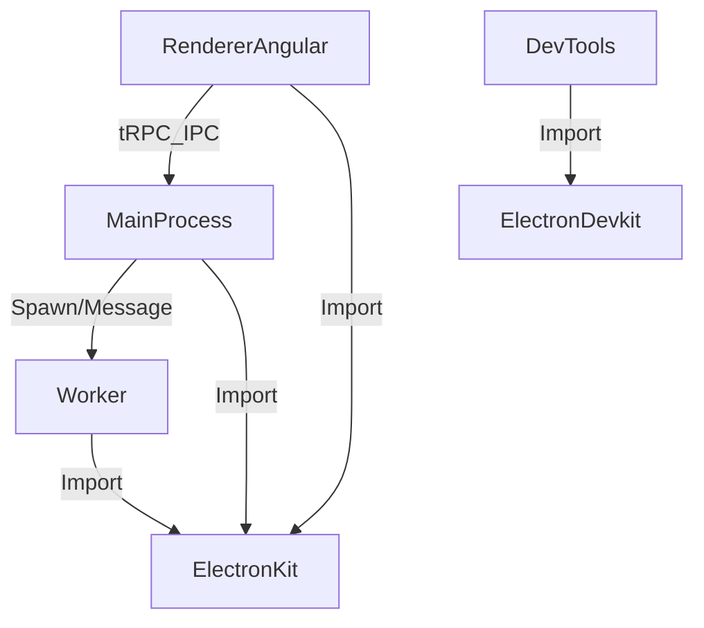

# 🏗️ Kiến trúc dự án Ecoma Desktop

## 1. Tổng quan cấu trúc thư mục

```
tikertok-source/
  ├─ apps/
  │   └─ tiktok-automate/
  │       ├─ main/         # Electron main process
  │       ├─ renderer/     # Giao diện người dùng (Angular)
  │       └─ e2e/          # Kiểm thử end-to-end
  ├─ packages/
  │   ├─ electron-devkit/  # Devtools và Chrome extensions
  │   ├─ electron-kit/     # Core Electron services và tRPC
  │   └─ nx-electron/      # Nx plugin cho Electron
  ├─ docs/                 # Tài liệu dự án
  ├─ mock-update/          # Mock files cho testing
  └─ ...
```

## 2. Các thành phần chính

### Apps
- **tiktok-main (`apps/tiktok-automate/main`):**
  - Quản lý cửa sổ, lifecycle app, cập nhật, giao tiếp hệ điều hành
  - Cung cấp API cho renderer qua tRPC (IPC)
- **tiktok-renderer (`apps/tiktok-automate/renderer`):**
  - Giao diện người dùng, xây dựng bằng Angular
  - Giao tiếp với main qua tRPC
- **tiktok-e2e (`apps/tiktok-automate/e2e`):**
  - Kiểm thử hành vi người dùng, đảm bảo chất lượng sản phẩm

### Packages
- **electron-devkit (`packages/electron-devkit`):**
  - Devtools và Chrome extensions management
  - Extension downloader, loader, installer
- **electron-kit (`packages/electron-kit`):**
  - Core Electron services (window manager, dialog, updater)
  - tRPC routers và services
  - Base configuration và utilities
- **nx-electron (`packages/nx-electron`):**
  - Nx plugin cho Electron development
  - Executors cho build, serve, package

## 3. Luồng giao tiếp tổng quan



## 4. Ghi chú mở rộng
- Dự án sử dụng Nx 21.3.2 để quản lý monorepo, giúp phát triển module hóa, kiểm thử, build, CI/CD hiệu quả.
- Có thể mở rộng thêm các package, module mới mà không ảnh hưởng lõi.
- Mọi giao tiếp giữa main và renderer đều đi qua tRPC để đảm bảo type-safe và bảo mật.
- Sử dụng Angular 20.1.2 cho frontend và Electron 36.7.1 cho desktop app.

> **Bạn có thể đóng góp bổ sung chi tiết cho từng module hoặc gửi câu hỏi về kiến trúc tại mục FAQ!** 
