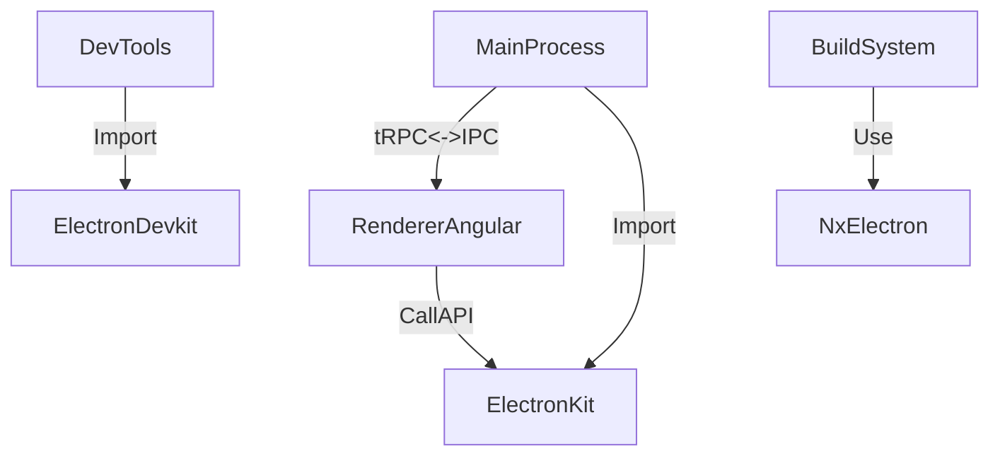

# 🎉 Giới thiệu dự án Ecoma Desktop

## Mục đích dự án
Ecoma Desktop là một ứng dụng desktop đa nền tảng, hỗ trợ quản lý, tự động hóa và tối ưu hóa các tác vụ liên quan đến TikTok, được phát triển dựa trên nền tảng Electron và Nx.

## Tính năng chính
- Quản lý nhiều tài khoản TikTok
- Tự động hóa các thao tác thường gặp
- Hỗ trợ cập nhật, đồng bộ dữ liệu nhanh chóng
- Giao diện hiện đại, dễ sử dụng
- Chrome extensions và devtools integration

## Tech stack nổi bật
- **Electron 36.7.1**: Nền tảng phát triển ứng dụng desktop đa nền tảng
- **Angular 20.1.2**: Xây dựng giao diện người dùng (renderer process)
- **tRPC**: Cung cấp giao tiếp type-safe giữa main và renderer thông qua IPC của Electron
- **Nx 21.3.2**: Quản lý monorepo, hỗ trợ phát triển module hóa, kiểm thử, build, CI/CD
- **Playwright**: End-to-end testing framework

## Kiến trúc tổng quan
Dự án sử dụng kiến trúc monorepo với Nx, bao gồm các thành phần chính:

### Apps
- **tiktok-main**: Electron main process - Quản lý cửa sổ, giao tiếp hệ điều hành, cập nhật ứng dụng
- **tiktok-renderer**: Angular UI - Giao diện người dùng, tương tác với người dùng cuối
- **tiktok-e2e**: End-to-end testing với Playwright

### Packages
- **electron-devkit**: Chrome extensions và devtools management
- **electron-kit**: Core Electron services và tRPC routers
- **nx-electron**: Nx plugin cho Electron development

